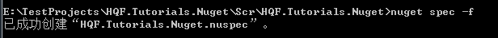
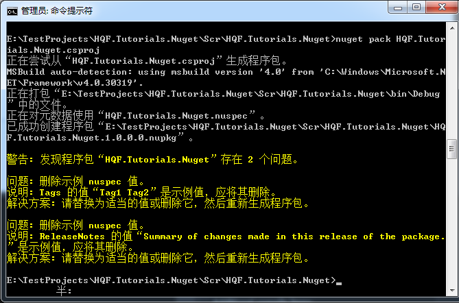

# HQF.Tutorials.Nuget
Demo project for Nuget Package.

## Install Nuget

### NuGet CLI

```choco install nuget.commandline```

More info,refer [here](https://docs.nuget.org/ndocs/guides/install-nuget)


### NuGetPackageExplorer

[](https://github.com/NuGetPackageExplorer/NuGetPackageExplorer)


## Create a Package

1.
```nuget spec```

 


2.
``` nuget pack [project name] ```
 


## Error


## Package for X64 and X86

[How should I create or upload a 32-bit and 64-bit NuGet package?](http://stackoverflow.com/a/11376762/1616023)