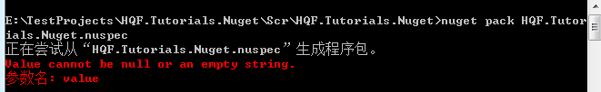
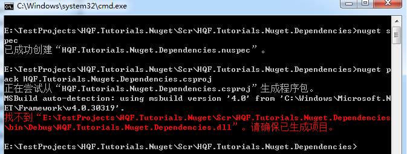
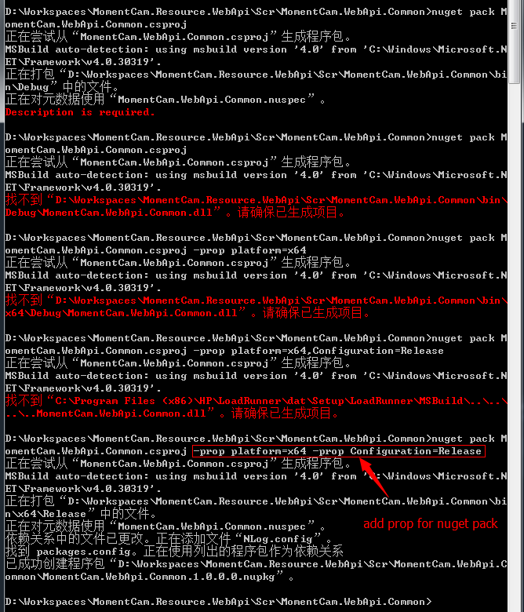

# HQF.Tutorials.Nuget
Demo project for Nuget Package.

## Install Nuget

### NuGet CLI

```choco install nuget.commandline```

More info,refer [here](https://docs.nuget.org/ndocs/guides/install-nuget)


### NuGetPackageExplorer

[](https://github.com/NuGetPackageExplorer/NuGetPackageExplorer)


## Create a Package

1.
```nuget spec```   

 


2.
``` nuget pack [project name] ```  
 


## Error
1. Value cannot be null or an empty string.
  
[More info](https://github.com/NuGet/Home/issues/2714)

-----
2. Not Build Project  


---
3. Error need to specifi the parameter for `nuget pack`
  

We should specify the prop parameter for `nuget pack`  
such as  
```
nuget pakc [projectname] -prop platform=x64 -prop Configuration=Release
```


---
## Package for X64 and X86

[How should I create or upload a 32-bit and 64-bit NuGet package?](http://stackoverflow.com/a/11376762/1616023)